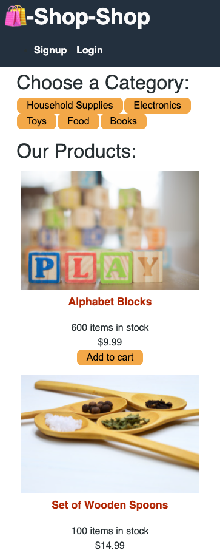

# shop-shop

## Description

An online e-commerce application that that utilizes indexedDB in order to provide the user a seamless application interaction. The application has also been configured to use redux as it's state management throughout the react components.

---

## Link to Deployed Application

https://nameless-hamlet-25639.herokuapp.com/

---

## Table of Contents

- [Installation](#installation)
- [Usage](#usage)
- [License](#license)
- [Questions](#questions)

---

## Installation

Clone the repository to your local machine. On the root of the application run the command 'npm install' and then "npm run seed" to seed the application with store items. "npm run develop" will start your development side server"

---

## Usage

An -commerce application that can be used to sell items online"

---

## License

---

## Contributing

- allanp94

---

## Tests

The project functionality has been tested by allanp94 in order to get the expected application functionality after integrating the redux library to the application"

---

## Questions

Github Name: allanp94
(https://www.github.com/allanp94)

Please contact me with any questions/opportunities at my email listed below.
Email: allan.p94@gmail.com

## Screenshot

